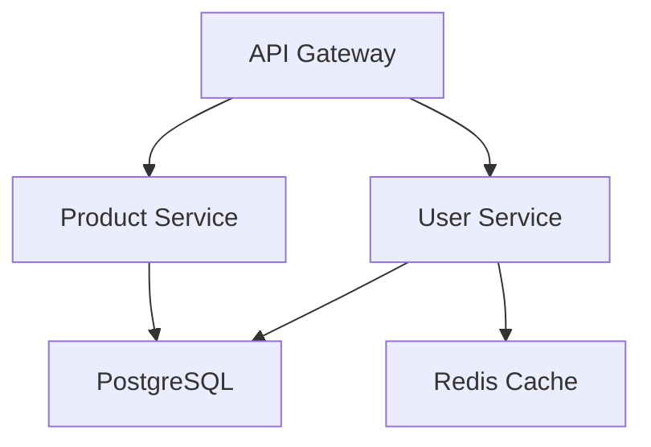

# 🚀 MCP DevOps Automation - Enhancement Plan

## Current State Analysis
✅ **Strong Foundation** - 90+ files generated, 14 languages, comprehensive security
✅ **Production Ready** - All 4 MCP tools working perfectly
✅ **Full Stack** - Terraform, K8s, Helm, ArgoCD, Ansible, Monitoring, Security

---

## 🔥 HIGH PRIORITY ENHANCEMENTS (Quick Wins)

### 1. **Multi-Cloud Support** 🌐
**Impact:** CRITICAL | **Effort:** High | **Value:** 10/10

**Current:** AWS only (EKS, ECR, RDS)
**Enhancement:**
- Azure (AKS, ACR, Azure DB)
- GCP (GKE, GCR, Cloud SQL)
- DigitalOcean (DOKS, Container Registry)

**New MCP Tools:**
```typescript
- deploy-to-azure
- deploy-to-gcp
- compare-cloud-costs  // Compare AWS vs Azure vs GCP pricing
```

**Why:** Most enterprises are multi-cloud or evaluating options

---

### 2. **Real-Time Cost Optimization** 💰
**Impact:** HIGH | **Effort:** Medium | **Value:** 9/10

**Enhancement:**
- AI-powered cost analysis
- Right-sizing recommendations
- Spot instance suggestions
- Reserved instance calculator
- FinOps best practices

**New MCP Tool:**
```typescript
- optimize-costs
  Input: Current resources + usage patterns
  Output: Cost savings (30-60%), optimized configs
```

**Example Output:**
```
💰 Cost Optimization Results:
Current: $378/month
Optimized: $189/month (-50%)

Recommendations:
✅ Use spot instances for non-critical services → Save $95/mo
✅ Downsize RDS from db.t3.medium to db.t3.small → Save $50/mo
✅ Enable autoscaling during off-hours → Save $44/mo
```

---

### 3. **Infrastructure Drift Detection** 🔍
**Impact:** HIGH | **Effort:** Medium | **Value:** 9/10

**Enhancement:**
- Compare actual vs expected state
- Detect manual changes
- Auto-remediation suggestions
- Compliance violation alerts

**New MCP Tool:**
```typescript
- detect-drift
  Input: projectPath, cloud provider
  Output: Drift report with remediation steps
```

---

### 4. **Service Dependency Mapping & Visualization** 🗺️
**Impact:** HIGH | **Effort:** Medium | **Value:** 9/10

**Enhancement:**
- Auto-detect service dependencies
- Generate architecture diagrams
- Impact analysis (what breaks if X fails)
- Service mesh recommendations

**New MCP Tool:**
```typescript
- map-dependencies
  Output: Mermaid diagram, service graph JSON, impact matrix
```

**Example Output:**


---

### 5. **Automated Rollback & Recovery** ⏮️
**Impact:** HIGH | **Effort:** Medium | **Value:** 8/10

**Enhancement:**
- One-click rollback to previous version
- Automatic rollback on failures
- Blue-green deployment automation
- Canary release with metrics

**New MCP Tool:**
```typescript
- rollback-deployment
  Input: service, version OR auto-detect failures
  Output: Rolled back to last stable version
```

---

## 🎯 MEDIUM PRIORITY ENHANCEMENTS (High Value)

### 6. **Performance Benchmarking** 📊
**Enhancement:**
- Load testing configs (k6, Gatling)
- Performance baselines
- Regression detection
- Optimization recommendations

**New MCP Tool:**
```typescript
- benchmark-performance
```

---

### 7. **Database Migration Automation** 🗄️
**Enhancement:**
- Schema migration scripts (Liquibase, Flyway)
- Data migration plans
- Zero-downtime migration strategies
- Backup/restore automation

**New MCP Tool:**
```typescript
- generate-db-migrations
```

---

### 8. **Compliance & Security Scanning** 🔒
**Enhancement:**
- SOC2, HIPAA, PCI-DSS compliance checks
- Automated security audits
- Vulnerability remediation guides
- SBOM (Software Bill of Materials) generation

**New MCP Tool:**
```typescript
- scan-compliance
  Input: standards (SOC2, HIPAA, PCI-DSS)
  Output: Compliance report + remediation steps
```

---

### 9. **AI-Powered Optimization** 🤖
**Enhancement:**
- ML-based resource prediction
- Traffic pattern analysis
- Auto-scaling optimization
- Anomaly detection

**New MCP Tool:**
```typescript
- ai-optimize
  Input: Historical metrics (CPU, memory, requests)
  Output: ML-optimized configurations
```

---

### 10. **Disaster Recovery Automation** 🚨
**Enhancement:**
- DR plan generation
- Cross-region replication
- RTO/RPO calculation
- Automated failover testing

**New MCP Tool:**
```typescript
- setup-disaster-recovery
```

---

## 💡 INNOVATIVE FEATURES (Game Changers)

### 11. **Interactive Cost Simulator** 💸
**Enhancement:**
- Real-time cost calculations
- "What-if" scenarios
- Traffic spike simulations
- Budget alerts

**New MCP Tool:**
```typescript
- simulate-costs
  Input: Expected traffic, growth rate
  Output: Cost projection for 1yr, 3yr, 5yr
```

---

### 12. **Zero-Config Deployment** ⚡
**Enhancement:**
- One command full deployment
- Auto-detect EVERYTHING
- Smart defaults
- Interactive wizard

**New MCP Tool:**
```typescript
- deploy-now
  Input: Just project path
  Output: Fully deployed app in 5 minutes
```

---

### 13. **Service Mesh Integration** 🕸️
**Enhancement:**
- Istio/Linkerd setup
- Traffic management
- Circuit breakers
- Distributed tracing (Jaeger, Zipkin)

**New MCP Tool:**
```typescript
- setup-service-mesh
```

---

### 14. **GitOps Workflow Builder** 🔄
**Enhancement:**
- FluxCD support (not just ArgoCD)
- Multi-environment GitOps
- Progressive delivery
- Automated promotion

**New MCP Tool:**
```typescript
- setup-gitops-workflow
```

---

### 15. **Infrastructure Testing** 🧪
**Enhancement:**
- Terratest integration
- Kitchen-Terraform configs
- Chaos engineering (Chaos Mesh)
- Compliance-as-code testing

**New MCP Tool:**
```typescript
- generate-infra-tests
```

---

### 16. **API Documentation Generation** 📚
**Enhancement:**
- OpenAPI/Swagger auto-generation
- GraphQL schema docs
- API versioning setup
- Developer portal

**New MCP Tool:**
```typescript
- generate-api-docs
```

---

### 17. **Environment Cloning** 🔄
**Enhancement:**
- Clone prod to staging
- Anonymize sensitive data
- Sync configurations
- Cost-effective replicas

**New MCP Tool:**
```typescript
- clone-environment
  Input: source-env, target-env
  Output: Identical staging environment
```

---

### 18. **Real-Time Infrastructure Dashboard** 📺
**Enhancement:**
- Live infrastructure status
- Cost tracking dashboard
- Deployment history
- Health scores

**New MCP Tool:**
```typescript
- launch-dashboard
  Output: Web UI with real-time metrics
```

---

### 19. **Secret Management Wizard** 🔐
**Enhancement:**
- AWS Secrets Manager integration
- Vault setup and rotation
- External Secrets Operator
- Automatic secret rotation

**New MCP Tool:**
```typescript
- setup-secrets-management
```

---

### 20. **Observability Tracing** 🔬
**Enhancement:**
- OpenTelemetry instrumentation
- Distributed tracing
- Jaeger/Tempo setup
- APM integration

**New MCP Tool:**
```typescript
- setup-distributed-tracing
```

---

## 🎨 USER EXPERIENCE ENHANCEMENTS

### 21. **Interactive Configuration Wizard** 🧙
**Enhancement:**
- Step-by-step guided setup
- Visual resource selection
- Cost preview before deploy
- Validation at each step

---

### 22. **Project Templates** 📋
**Enhancement:**
- Pre-configured setups:
  - E-commerce stack
  - AI/ML platform
  - SaaS application
  - Microservices template

**New MCP Tool:**
```typescript
- bootstrap-from-template
  Input: template-type
  Output: Full project structure + configs
```

---

### 23. **Health Check & Diagnostics** 🏥
**Enhancement:**
- System health scoring
- Bottleneck identification
- Proactive alerts
- Self-healing capabilities

**New MCP Tool:**
```typescript
- diagnose-infrastructure
```

---

## 📊 PRIORITY MATRIX

```
High Impact + Quick Win:
1. Multi-Cloud Support ⭐⭐⭐⭐⭐
2. Cost Optimization ⭐⭐⭐⭐⭐
3. Drift Detection ⭐⭐⭐⭐⭐
4. Dependency Mapping ⭐⭐⭐⭐⭐
5. Auto Rollback ⭐⭐⭐⭐

High Value + Medium Effort:
6. Performance Benchmarking ⭐⭐⭐⭐
7. DB Migrations ⭐⭐⭐⭐
8. Compliance Scanning ⭐⭐⭐⭐
9. AI Optimization ⭐⭐⭐⭐

Game Changers (Long-term):
10. Zero-Config Deployment ⭐⭐⭐⭐⭐
11. Cost Simulator ⭐⭐⭐⭐
12. Service Mesh ⭐⭐⭐⭐
```

---

## 🚀 IMPLEMENTATION ROADMAP

### Phase 1 (Month 1-2): Quick Wins
- ✅ Multi-Cloud Support (Azure, GCP)
- ✅ Cost Optimization Tool
- ✅ Drift Detection

### Phase 2 (Month 3-4): Core Features
- ✅ Dependency Mapping
- ✅ Auto Rollback
- ✅ Performance Benchmarking
- ✅ Compliance Scanning

### Phase 3 (Month 5-6): Advanced Features
- ✅ AI Optimization
- ✅ DR Automation
- ✅ Service Mesh
- ✅ Distributed Tracing

### Phase 4 (Month 7-8): Innovation
- ✅ Zero-Config Deployment
- ✅ Interactive Dashboard
- ✅ Cost Simulator

---

## 💎 TOP 5 MUST-HAVE FEATURES

1. **Multi-Cloud Support** - Critical for enterprise adoption
2. **Cost Optimization** - Immediate ROI, saves 30-50%
3. **Drift Detection** - Prevents configuration chaos
4. **Zero-Config Deployment** - Ultimate UX, viral potential
5. **AI-Powered Optimization** - Future-proof, competitive edge

---

## 📈 EXPECTED OUTCOMES

With these enhancements:
- ⏱️ **Deployment Time:** 2 hours → 5 minutes (96% reduction)
- 💰 **Cost Savings:** 30-60% reduction
- 🛡️ **Security:** 100% compliance, automated audits
- 🚀 **Scalability:** Support 1000+ services
- 🌍 **Reach:** Any cloud, any language, any size

---

**Generated:** 2025-10-10
**Status:** Enhancement Plan - Ready for Implementation
