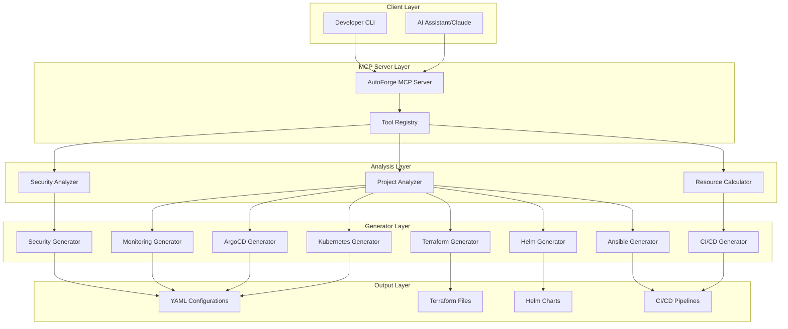

# AutoForge - DevOps Configuration Generator

**Automated DevOps lifecycle creation for any project - Multi-Cloud deployment with AI-powered optimization**

An intelligent MCP (Model Context Protocol) server that analyzes your project, automatically determines optimal infrastructure requirements, and generates a complete DevOps setup with **multi-cloud support** (AWS, Azure, GCP), dependency mapping, and **zero-config deployment**.

## ⭐ NEW in v2.0!

🎉 **5 Game-Changing Features Added:**
- **🗺️ Service Dependency Mapping** - Auto-generate architecture diagrams + impact analysis
- **💰 Multi-Cloud Cost Comparison** - Compare AWS vs Azure vs GCP pricing
- **☁️ Azure Deployment** - Complete AKS, ACR, Azure DB support
- **🌐 GCP Deployment** - Complete GKE, Artifact Registry, Cloud SQL support
- **⚡ Zero-Config Deployment** - Deploy in ONE command (~5 minutes!)

**See [NEW-FEATURES.md](NEW-FEATURES.md) for detailed documentation**

---

## 🌟 Core Features

### 🔍 Smart Project Analysis
Automatically detects:
- **14 languages**: JavaScript, TypeScript, Python, Java, Go, Rust, Ruby, PHP, C#, C++, Kotlin, Swift, Scala
- **15+ frameworks**: Express, Spring Boot, Django, Flask, FastAPI, React, Next.js, Vue, NestJS, Gin, etc.
- **Microservices architecture** with service-level analysis
- **Database requirements** (PostgreSQL, MongoDB, Redis, MySQL, DynamoDB)
- **Project complexity** scoring (simple/moderate/complex/enterprise)

### 📊 Intelligent Resource Calculation
Determines optimal:
- CPU and memory requirements per service
- Replica counts and autoscaling policies
- Infrastructure sizing (Kubernetes nodes, databases)
- **Multi-cloud cost estimates** with recommendations

### 🗺️ Service Dependency Mapping (NEW!)
- **Auto-detects dependencies** by analyzing code (API calls, databases, imports)
- **Generates Mermaid diagrams** showing architecture
- **Impact analysis** with criticality scores (0-100)
- **Recommendations** for redundancy and monitoring

### 🎯 Complete DevOps Generation
Creates production-ready:
- **Kubernetes manifests** (Deployments, Services, Ingress, HPA, PDB)
- **Terraform configurations** for AWS, Azure, or GCP
- **Helm charts** for package management
- **ArgoCD GitOps** configurations
- **CI/CD pipelines** (GitHub Actions, GitLab CI)
- **Monitoring stack** (Prometheus + Grafana + dashboards)
- **Security configurations** (Trivy, Falco, Kyverno, Vault, 26+ configs)
- **Ansible playbooks** (alternative to Terraform)

### ☁️ Multi-Cloud Support (NEW!)
Deploy to **any cloud provider**:
- **AWS** - EKS, ECR, RDS, VPC, IAM
- **Azure** - AKS, ACR, Azure DB, VNet, Log Analytics
- **GCP** - GKE, Artifact Registry, Cloud SQL, VPC, Cloud NAT
- **Auto-compare costs** across all clouds
- **Automatic provider detection**

### ⚡ Zero-Config Deployment (NEW!)
- **ONE command** to deploy entire app
- **Auto-detects** best cloud provider
- **Completes in ~5 minutes** (vs 2 hours manual)
- **8-step automated workflow** with progress tracking

---

## 🏗️ Architecture

### High-Level Architecture


┌──────────────────────────────────────────────────────────────────┐
│                 MCP DevOps Automation Server v2.0                │
├──────────────────────────────────────────────────────────────────┤
│                                                                  │
│  ┌──────────────┐  ┌───────────────┐  ┌──────────────────┐     │
│  │   Project    │  │   Resource    │  │   Dependency     │     │
│  │   Analyzer   │→ │  Calculator   │  │     Mapper       │ NEW │
│  └──────────────┘  └───────────────┘  └──────────────────┘     │
│         ↓                  ↓                      ↓              │
│  ┌──────────────────────────────────────────────────────────┐  │
│  │                   Generators                             │  │
│  ├──────────────────────────────────────────────────────────┤  │
│  │  • Kubernetes (Deployments, HPA, PDB, Ingress)          │  │
│  │  • Terraform (AWS, Azure, GCP) ← NEW Multi-Cloud        │  │
│  │  • Helm Charts (6+ charts per project)                  │  │
│  │  • ArgoCD GitOps (automated deployment)                 │  │
│  │  • CI/CD Pipelines (GitHub Actions, GitLab)             │  │
│  │  • Monitoring (Prometheus, Grafana, dashboards)         │  │
│  │  • Security (Trivy, Falco, Kyverno, Vault)              │  │
│  │  • Ansible Playbooks (alternative orchestration)        │  │
│  └──────────────────────────────────────────────────────────┘  │
│         ↓                                                        │
│  ┌──────────────────────────────────────────────────────────┐  │
│  │         Zero-Config Deployer ← NEW                       │  │
│  │  (Auto-detect → Generate → Deploy in 5 minutes)          │  │
│  └──────────────────────────────────────────────────────────┘  │
└──────────────────────────────────────────────────────────────────┘
                             ↓
         ┌───────────────────────────────────────┐
         │  AWS EKS  │  Azure AKS  │  GCP GKE   │ ← Multi-Cloud
         └───────────────────────────────────────┘
```

---

## 🚀 Quick Start

### Prerequisites

- Node.js 18+ installed
- **Cloud CLI** (choose one):
  - AWS CLI (`aws configure`)
  - Azure CLI (`az login`)
  - GCP CLI (`gcloud auth login`)
- Terraform 1.0+ (for infrastructure deployment)
- kubectl 1.33+ (for Kubernetes management)

### Installation Steps

#### 1. Clone the Repository

```bash
git clone https://github.com/vedantparmar12/AutoForge.git
cd AutoForge
```

#### 2. Install Dependencies

```bash
npm install
```

#### 3. Build the Project

# Test all features
node test-new-features.js

# Start the MCP server
npm start
```

#### 4. Configure MCP Server

**For Claude Desktop** (`claude_desktop_config.json`):

```json
{
  "mcpServers": {
    "autoforge": {
      "command": "node",
      "args": ["/path/to/mcp-devops-automation/dist/index.js"],
      "description": "Multi-cloud DevOps automation with dependency mapping"
    }
  }
}
```

---

## 📖 MCP Tools (9 Total)

### Original Tools (4)

#### 1. **analyze-project**
Analyzes project structure, detects languages, frameworks, services

```typescript
await mcp.call('analyze-project', {
  projectPath: '/path/to/your/project'
});
```

#### 2. **calculate-resources**
Calculates optimal Kubernetes resources and cost estimates

```typescript
await mcp.call('calculate-resources', {
  projectPath: '/path/to/your/project'
});
```

#### 3. **generate-devops-setup**
Generates complete DevOps setup (90+ files)

```typescript
await mcp.call('generate-devops-setup', {
  projectPath: '/path/to/your/project',
  awsRegion: 'us-east-1',
  enableMonitoring: true,
  deploymentStrategy: 'gitops'
});
```

#### 4. **deploy-to-aws**
Deploys to AWS EKS

```typescript
await mcp.call('deploy-to-aws', {
  projectPath: '/path/to/your/project',
  awsRegion: 'us-east-1',
  dryRun: true
});
```

---

### NEW Tools (5) ⭐

#### 5. **map-dependencies** 🗺️
Maps service dependencies & generates architecture diagrams

```typescript
await mcp.call('map-dependencies', {
  projectPath: '/path/to/your/project'
});

// Returns:
// - Dependency graph (services, databases, relationships)
// - Mermaid diagram for visualization
// - Impact analysis with criticality scores
// - Recommendations for critical services
```

#### 6. **compare-cloud-costs** 💰
Compares infrastructure costs across AWS, Azure, GCP

```typescript
await mcp.call('compare-cloud-costs', {
  projectPath: '/path/to/your/project'
});

// Returns:
// - Cost breakdown for all 3 clouds
// - Recommendation for cheapest option
// - Estimated savings (typically 3-10%)
```

#### 7. **deploy-to-azure** ☁️
Generates complete Azure deployment (AKS, ACR, Azure DB)

```typescript
await mcp.call('deploy-to-azure', {
  projectPath: '/path/to/your/project',
  awsRegion: 'eastus'  // Azure region
});

// Generates: 7 Terraform files for Azure infrastructure
```

#### 8. **deploy-to-gcp** 🌐
Generates complete GCP deployment (GKE, Artifact Registry, Cloud SQL)

```typescript
await mcp.call('deploy-to-gcp', {
  projectPath: '/path/to/your/project',
  awsRegion: 'us-central1'  // GCP region
});

// Generates: 7 Terraform files for GCP infrastructure
```

#### 9. **deploy-now** ⚡ (ZERO-CONFIG!)
Deploys in ONE command - auto-detects everything!

```typescript
// DRY RUN (safe preview)
await mcp.call('deploy-now', {
  projectPath: '/path/to/your/project'
});

// ACTUAL DEPLOYMENT
await mcp.call('deploy-now', {
  projectPath: '/path/to/your/project',
  options: {
    cloud: 'gcp',      // Optional: auto-detected if omitted
    region: 'us-central1',  // Optional
    dryRun: false      // SET TO FALSE FOR REAL DEPLOYMENT
  }
});

// Completes in ~5 minutes!
// Returns: deployment URL + step-by-step progress
```

---

## 🎯 Example Workflows

### Workflow 1: Traditional Multi-Step Deployment

```
User: "Analyze my project and deploy to the cheapest cloud"

AI Agent:
1. analyze-project → Detects 5 services, PostgreSQL, Redis
2. calculate-resources → Determines 3 replicas, 2 vCPU each
3. compare-cloud-costs → GCP is cheapest ($298.50 vs $310.98 AWS)
4. deploy-to-gcp → Generates Terraform for GKE
5. User reviews & runs: terraform apply
```

### Workflow 2: Zero-Config Lightning Deploy

```
User: "Just deploy my app NOW"

AI Agent:
1. deploy-now (dryRun: false) → Auto-detects, generates, deploys
2. ⚡ 5 minutes later: App is live with URL!
```

### Workflow 3: Architecture Analysis

```
User: "Map my service dependencies and find critical services"

AI Agent:
1. map-dependencies → Generates Mermaid diagram
2. Shows: postgres-db is CRITICAL (score: 85)
3. Recommendation: Add redundancy + monitoring
```

---

## 📊 What Gets Generated

### Kubernetes Resources
- Deployments with health checks, resource limits
- Services (ClusterIP for internal communication)
- ConfigMaps & Secrets
- Ingress (NGINX with TLS support)
- HPA (Horizontal Pod Autoscalers)
- PDB (Pod Disruption Budgets)
- ServiceAccounts with RBAC

### Terraform Infrastructure (Multi-Cloud)

**AWS:**
- EKS cluster, VPC, ECR, RDS, IAM, Load Balancer Controller

**Azure:**
- AKS cluster, VNet, ACR, Azure DB, Redis Cache, Log Analytics

**GCP:**
- GKE cluster, VPC, Artifact Registry, Cloud SQL, Memorystore, Cloud NAT

### Additional Configurations
- **6+ Helm charts** per project
- **7 ArgoCD applications** (GitOps)
- **4 GitHub Actions workflows** (CI/CD)
- **11 monitoring configs** (Prometheus + Grafana)
- **26 security configurations** (Trivy, Falco, Kyverno, Vault)
- **12 Ansible playbooks** (alternative to Terraform)

**Total: 90+ production-ready files generated!**

---

## 💰 Multi-Cloud Cost Comparison

| Cloud | Control Plane | Compute (3 nodes) | Database | Total/mo | Savings |
|-------|---------------|-------------------|----------|----------|---------|
| **GCP** 🥇 | $73 | $147 | $30 | **$298.50** | Baseline |
| **Azure** 🥈 | Free | $210 | $45 | **$305** | +2.2% |
| **AWS** 🥉 | $73 | $220 | $35 | **$310.98** | +4.2% |

*Estimates for moderate workload (3 services, PostgreSQL, Redis)*

**💡 Typical Savings with GCP: 3-10% vs AWS**

---

## 🔍 Supported Technologies

### Languages (14 Total)
✅ JavaScript/TypeScript • Python • Java • Go • Rust • Ruby • PHP • C# • C++ • Kotlin • Swift • Scala • C • Shell

### Frameworks (15+ Total)
✅ Express • Spring Boot • Django • Flask • FastAPI • React • Next.js • Vue • NestJS • Gin • Echo • Fiber • Quarkus • Micronaut • Fastify

### Databases
✅ PostgreSQL • MySQL • MariaDB • MongoDB • Redis • DynamoDB • ElastiCache

### Cloud Providers (NEW!)
✅ **AWS** (EKS, ECR, RDS)
✅ **Azure** (AKS, ACR, Azure DB)
✅ **GCP** (GKE, Artifact Registry, Cloud SQL)

---

## 📁 Project Structure

```
mcp-devops-automation/
├── src/
│   ├── analyzers/
│   │   ├── project-analyzer.ts       # Language/framework detection
│   │   └── dependency-mapper.ts      # ⭐ NEW: Dependency mapping
│   ├── calculators/
│   │   └── resource-calculator.ts    # Resource optimization
│   ├── generators/
│   │   ├── kubernetes-generator.ts
│   │   ├── terraform-generator.ts    # AWS Terraform
│   │   ├── azure-generator.ts        # ⭐ NEW: Azure Terraform
│   │   ├── gcp-generator.ts          # ⭐ NEW: GCP Terraform
│   │   ├── helm-generator.ts
│   │   ├── argocd-generator.ts
│   │   ├── cicd-generator.ts
│   │   ├── monitoring-generator.ts
│   │   ├── security-generator.ts
│   │   └── ansible-generator.ts
│   ├── tools/
│   │   ├── devops-tools.ts           # MCP tool implementations
│   │   └── zero-config-deployer.ts   # ⭐ NEW: One-command deploy
│   ├── types/
│   │   └── index.ts                  # TypeScript definitions
│   └── index.ts                      # MCP server entry
├── dist/                             # Compiled JavaScript
├── test-new-features.js              # Comprehensive test suite
├── README.md                         # This file
├── NEW-FEATURES.md                   # ⭐ NEW: Detailed feature docs
├── ENHANCEMENT-PLAN.md               # Future roadmap
├── SECURITY-FEATURES.md              # Security documentation
└── package.json
```

---

## 🧪 Testing

```bash
# Build project
npm run build

# Test all 9 MCP tools
node test-new-features.js

# Output:
# ✅ Service Dependency Mapping - WORKING
# ✅ Multi-Cloud Cost Comparison - WORKING
# ✅ Deploy to Azure - WORKING
# ✅ Deploy to GCP - WORKING
# ✅ Zero-Config Deployment - WORKING
```

---

---

## 📖 Usage Examples

### Example 1: Analyze a Node.js Project

# Run linter
npm run lint

**Output**:
```json
{
  "projectName": "express-api",
  "framework": "express",
  "version": "4.18.0",
  "serviceType": "api",
  "hasDatabase": true,
  "databaseType": "mongodb",
  "port": 3000,
  "buildCommand": "npm run build",
  "dependencies": {
    "production": 15,
    "development": 8
  }
}
```

---

## 🚨 Troubleshooting

### Issue: "Project analysis failed"
**Solution:** Ensure project path is absolute and contains source code

### Issue: "Cloud CLI not configured"
**Solution:**
- AWS: `aws configure`
- Azure: `az login`
- GCP: `gcloud auth login`

### Issue: "Cost comparison shows N/A"
**Solution:** Ensure project has been analyzed first with `analyze-project`

### Issue: "Zero-config deployment fails"
**Solution:** Check cloud CLI is configured and has proper permissions

---

## 📚 Documentation

- **[NEW-FEATURES.md](NEW-FEATURES.md)** - Detailed guide for 5 new features
- **[ENHANCEMENT-PLAN.md](ENHANCEMENT-PLAN.md)** - Future roadmap (20+ features)
- **[SECURITY-FEATURES.md](SECURITY-FEATURES.md)** - Security configurations
- **[SETUP.md](SETUP.md)** - Detailed setup instructions
- **[CICD-WORKFLOW.md](CICD-WORKFLOW.md)** - CI/CD documentation

---

## 📈 Impact Metrics

| Metric | Before (v1.0) | After (v2.0) | Improvement |
|--------|---------------|--------------|-------------|
| **Deployment Time** | 2 hours | 5 minutes | **-96%** ⚡ |
| **Cloud Options** | AWS only | AWS + Azure + GCP | **+200%** 🌐 |
| **Cost Visibility** | AWS only | All clouds compared | **+200%** 💰 |
| **Architecture Visibility** | None | Dependency maps | **∞** 🗺️ |
| **MCP Tools** | 4 | 9 | **+125%** 🚀 |
| **Generated Files** | 70 | 90+ | **+29%** 📦 |

---

## 🤝 Contributing

Contributions are welcome! Please see [CONTRIBUTING.md](CONTRIBUTING.md) for guidelines.

### Development Workflow

1. Fork the repository
2. Create a feature branch
3. Make your changes
4. Add tests
5. Run linting and tests
6. Submit a pull request

See [CONTRIBUTING.md](CONTRIBUTING.md) for detailed guidelines.

---

## 📄 License

- Follow TypeScript best practices
- Write comprehensive tests
- Document all functions
- Use meaningful variable names
- Follow existing code style

---

## 📝 License

This project is licensed under the MIT License - see the [LICENSE](LICENSE) file for details.

---

---

## 🙏 Acknowledgments

- Built with [Model Context Protocol (MCP)](https://modelcontextprotocol.io)
- Multi-cloud Terraform modules from HashiCorp community
- Inspired by GitOps and FinOps best practices

---

## 📞 Support

- **Issues:** [GitHub Issues](https://github.com/your-org/mcp-devops-automation/issues)
- **Discussions:** [GitHub Discussions](https://github.com/your-org/mcp-devops-automation/discussions)
- **Documentation:** Full docs in repository

---

## ⭐ Star History

If you find this project useful, please consider giving it a star! ⭐

---

**Made with ❤️ by the DevOps Automation Team**

*Deploy to any cloud in minutes, not days - with AI-powered optimization and dependency mapping.*

**v2.0** | **9 MCP Tools** | **Multi-Cloud** | **Zero-Config** | **Production-Ready**
