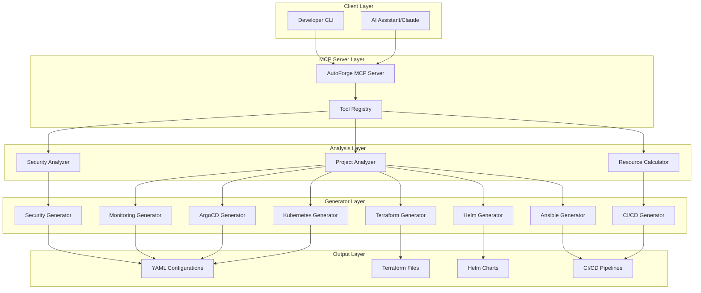
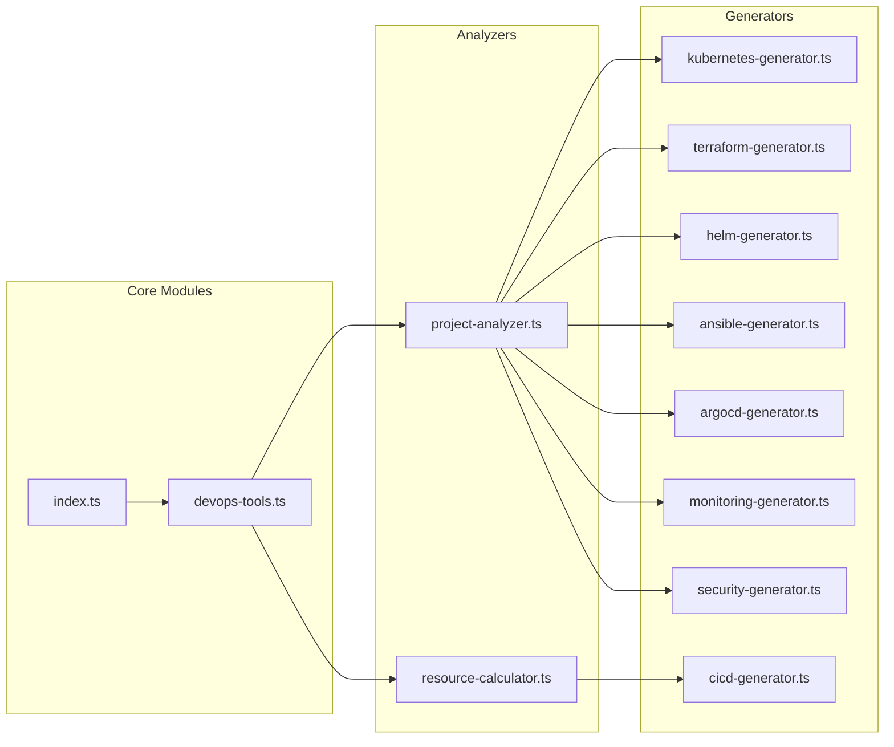
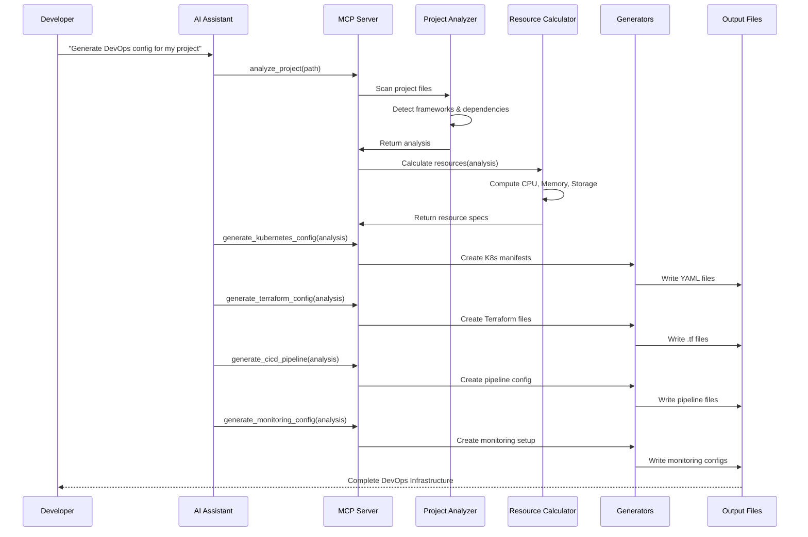
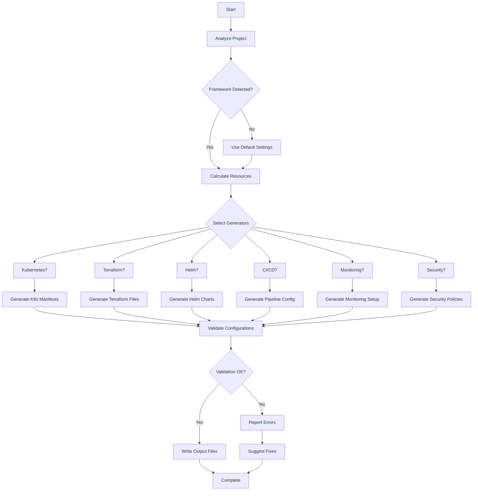

# AutoForge - DevOps Configuration Generator

## 🚀 Executive Summary

**AutoForge** is a comprehensive DevOps automation platform that analyzes codebases and automatically generates production-ready infrastructure, CI/CD pipelines, security configurations, and monitoring solutions. Built as a Model Context Protocol (MCP) server, it integrates seamlessly with AI assistants like Claude to provide intelligent DevOps automation.

---

## 📋 Table of Contents

1. [Overview](#overview)
2. [Architecture](#architecture)
3. [Core Components](#core-components)
4. [Workflow](#workflow)
5. [Setup Instructions](#setup-instructions)
6. [How It Works](#how-it-works)
7. [Features](#features)
8. [Usage Examples](#usage-examples)
9. [Technology Stack](#technology-stack)
10. [Security](#security)

---

## 🎯 Overview

### What is AutoForge?

AutoForge is an intelligent DevOps assistant that:
- **Analyzes** your project structure and dependencies
- **Calculates** resource requirements automatically
- **Generates** complete DevOps configurations
- **Provides** best practices and security recommendations
- **Creates** production-ready deployment artifacts

### Key Benefits

✅ **Time Savings**: Reduce configuration time from days to minutes  
✅ **Best Practices**: Industry-standard configurations built-in  
✅ **Consistency**: Standardized DevOps across all projects  
✅ **Security First**: Built-in security scanning and policies  
✅ **Multi-Platform**: Support for various cloud providers and tools  

---

## 🏗️ Architecture

### High-Level Architecture



### Component Architecture



---

## 🔧 Core Components

### 1. **Project Analyzer** (`project-analyzer.ts`)

**Purpose**: Analyzes project structure, detects frameworks, and identifies technology stack

**Key Functions**:
- Framework detection (React, Angular, Vue, Express, Django, Spring Boot, etc.)
- Dependency analysis
- Service type identification
- Database detection
- Port configuration
- Build command detection

**Output**: Comprehensive project analysis with recommendations

### 2. **Resource Calculator** (`resource-calculator.ts`)

**Purpose**: Calculates optimal resource allocations based on project characteristics

**Calculations**:
- CPU requirements (requests & limits)
- Memory requirements (requests & limits)
- Storage needs
- Replica counts
- Autoscaling parameters
- Node affinity rules

**Algorithm**:
```typescript
Base Resources + Framework Weight + Dependency Impact + Traffic Load = Final Resources
```

### 3. **Kubernetes Generator** (`kubernetes-generator.ts`)

**Purpose**: Creates production-ready Kubernetes manifests

**Generates**:
- Deployment configurations
- Service definitions
- ConfigMaps
- Secrets (templates)
- Ingress rules
- PersistentVolumeClaims
- HorizontalPodAutoscaler
- NetworkPolicies

### 4. **Terraform Generator** (`terraform-generator.ts`)

**Purpose**: Generates Infrastructure as Code for cloud providers

**Supports**:
- AWS (ECS, RDS, S3, CloudFront, etc.)
- Azure (AKS, App Service, etc.)
- GCP (GKE, Cloud SQL, etc.)
- Multi-region deployments
- VPC/Network configurations
- Load balancers
- DNS management

### 5. **Helm Generator** (`helm-generator.ts`)

**Purpose**: Creates Helm charts for Kubernetes deployments

**Generates**:
- Chart.yaml
- values.yaml
- Template files
- NOTES.txt
- Dependency management

### 6. **CI/CD Generator** (`cicd-generator.ts`)

**Purpose**: Creates continuous integration and deployment pipelines

**Platforms**:
- GitHub Actions
- GitLab CI
- Jenkins
- Azure DevOps
- CircleCI

**Stages**:
- Build
- Test
- Security scanning
- Docker image build
- Deployment
- Rollback strategies

### 7. **Ansible Generator** (`ansible-generator.ts`)

**Purpose**: Generates configuration management playbooks

**Creates**:
- Inventory files
- Playbooks for application deployment
- Role definitions
- Variable files
- Handler configurations

### 8. **ArgoCD Generator** (`argocd-generator.ts`)

**Purpose**: Creates GitOps configurations for continuous deployment

**Generates**:
- Application manifests
- Project definitions
- Sync policies
- Health checks
- Automated sync waves

### 9. **Monitoring Generator** (`monitoring-generator.ts`)

**Purpose**: Sets up comprehensive monitoring and observability

**Components**:
- Prometheus configurations
- Grafana dashboards
- Alert rules
- ServiceMonitors
- Log aggregation (ELK/Loki)
- Distributed tracing (Jaeger)

### 10. **Security Generator** (`security-generator.ts`)

**Purpose**: Implements security best practices and policies

**Features**:
- RBAC policies
- PodSecurityPolicies
- NetworkPolicies
- Secret management
- Security scanning configurations
- Compliance policies
- Vault integration
- Certificate management

---

## 🔄 Workflow

### Complete Workflow Diagram



### Detailed Process Flow



---

## 🛠️ Setup Instructions

### Prerequisites

**Required Software**:
- Node.js 18+ or 20+
- npm or yarn
- Git

**Optional Tools** (for full functionality):
- Docker
- Kubernetes (kubectl)
- Terraform
- Helm

### Installation Steps

#### 1. Clone the Repository

```bash
git clone https://github.com/vedantparmar12/AutoForge.git
cd AutoForge
```

#### 2. Install Dependencies

```bash
npm install
```

#### 3. Build the Project

```bash
npm run build
```

#### 4. Configure MCP Server

**For Claude Desktop** (`claude_desktop_config.json`):

```json
{
  "mcpServers": {
    "autoforge": {
      "command": "node",
      "args": [
        "/path/to/AutoForge/build/index.js"
      ]
    }
  }
}
```

**For Cline** (VSCode Extension):

```json
{
  "mcpServers": {
    "autoforge": {
      "command": "node",
      "args": ["C:\\path\\to\\AutoForge\\build\\index.js"],
      "disabled": false,
      "alwaysAllow": []
    }
  }
}
```

#### 5. Verify Installation

Start your AI assistant and check for AutoForge tools:

```
Available tools:
- analyze_project
- calculate_resources
- generate_kubernetes_config
- generate_terraform_config
- generate_helm_chart
- generate_cicd_pipeline
...
```

### Environment Configuration

Create `.env` file (optional):

```env
# Default settings
DEFAULT_NAMESPACE=default
DEFAULT_REPLICAS=2
DEFAULT_CPU_REQUEST=100m
DEFAULT_MEMORY_REQUEST=128Mi

# Cloud provider settings
CLOUD_PROVIDER=aws
AWS_REGION=us-east-1

# Registry settings
DOCKER_REGISTRY=docker.io
```

---

## 🎮 How It Works

### Step-by-Step Execution

#### Phase 1: Project Analysis

1. **File Scanning**: Recursively scans project directory
2. **Pattern Matching**: Identifies framework-specific files
   - `package.json` → Node.js project
   - `requirements.txt` → Python project
   - `pom.xml` → Java/Maven project
   - `go.mod` → Go project
3. **Dependency Parsing**: Extracts and analyzes dependencies
4. **Service Classification**: Determines service type (web, api, worker, etc.)

**Example Analysis Output**:
```json
{
  "projectName": "my-app",
  "framework": "express",
  "serviceType": "api",
  "hasDatabase": true,
  "databaseType": "postgresql",
  "port": 3000,
  "buildCommand": "npm run build",
  "dependencies": ["express", "pg", "redis"]
}
```

#### Phase 2: Resource Calculation

**Algorithm**:

```typescript
function calculateResources(analysis) {
  // Base resources
  let cpu = 100; // millicores
  let memory = 128; // MB
  
  // Framework weight
  if (analysis.framework === 'spring-boot') {
    cpu += 200;
    memory += 384;
  }
  
  // Dependency impact
  memory += analysis.dependencies.length * 32;
  
  // Database connections
  if (analysis.hasDatabase) {
    cpu += 50;
    memory += 128;
  }
  
  // Apply safety margin
  return {
    cpuRequest: cpu + 'm',
    cpuLimit: (cpu * 2) + 'm',
    memoryRequest: memory + 'Mi',
    memoryLimit: (memory * 1.5) + 'Mi'
  };
}
```

#### Phase 3: Configuration Generation

Each generator follows this pattern:

1. **Load Templates**: Use Handlebars templates
2. **Inject Variables**: Replace placeholders with actual values
3. **Apply Best Practices**: Add security, monitoring, etc.
4. **Validate**: Check syntax and requirements
5. **Write Files**: Save to appropriate directories

**Example Kubernetes Generation**:

```typescript
// Input
const analysis = { projectName: 'my-app', port: 3000 }
const resources = { cpuRequest: '200m', memoryRequest: '256Mi' }

// Generate
const deployment = generateDeployment(analysis, resources)
const service = generateService(analysis)
const ingress = generateIngress(analysis)

// Output: deployment.yaml, service.yaml, ingress.yaml
```

#### Phase 4: Output Organization

Generated files are organized in a structured directory:

```
output/
├── kubernetes/
│   ├── deployment.yaml
│   ├── service.yaml
│   ├── ingress.yaml
│   ├── configmap.yaml
│   └── hpa.yaml
├── terraform/
│   ├── main.tf
│   ├── variables.tf
│   ├── outputs.tf
│   └── provider.tf
├── helm/
│   ├── Chart.yaml
│   ├── values.yaml
│   └── templates/
├── cicd/
│   ├── .github/
│   │   └── workflows/
│   └── .gitlab-ci.yml
├── monitoring/
│   ├── prometheus/
│   └── grafana/
└── security/
    ├── rbac.yaml
    └── network-policy.yaml
```

---

## ✨ Features

### 🔍 Project Analysis
- Multi-language support (JavaScript, Python, Java, Go, PHP, Ruby)
- Framework detection (20+ frameworks)
- Dependency analysis
- Database integration detection
- Build system identification

### 📊 Resource Management
- Intelligent resource calculation
- Auto-scaling configuration
- Resource quota management
- Cost optimization recommendations

### ☸️ Kubernetes Support
- Complete manifest generation
- Multi-environment support
- StatefulSets for databases
- ConfigMap and Secret management
- Network policies
- Pod security policies

### ☁️ Cloud Infrastructure
- AWS, Azure, GCP support
- Multi-region deployments
- CDN configuration
- DNS management
- Load balancer setup

### 🔄 CI/CD Pipelines
- GitHub Actions
- GitLab CI
- Jenkins
- Azure DevOps
- CircleCI
- Multi-stage pipelines
- Automated testing
- Security scanning

### 📈 Monitoring & Observability
- Prometheus metrics
- Grafana dashboards
- Custom alerts
- Log aggregation
- Distributed tracing
- APM integration

### 🔒 Security Features
- RBAC policies
- Network policies
- Secret management
- Vulnerability scanning
- Compliance checks
- Certificate management
- Policy enforcement

### 🎯 GitOps Ready
- ArgoCD configurations
- Flux compatibility
- Automated sync
- Rollback strategies

---

## 📖 Usage Examples

### Example 1: Analyze a Node.js Project

**Request**:
```
Analyze my Express.js project at /path/to/project
```

**Process**:
```typescript
analyze_project({
  projectPath: "/path/to/project"
})
```

**Output**:
```json
{
  "projectName": "express-api",
  "framework": "express",
  "version": "4.18.0",
  "serviceType": "api",
  "hasDatabase": true,
  "databaseType": "mongodb",
  "port": 3000,
  "buildCommand": "npm run build",
  "dependencies": {
    "production": 15,
    "development": 8
  }
}
```

### Example 2: Generate Complete DevOps Stack

**Request**:
```
Generate complete DevOps configuration for my project including Kubernetes, Terraform, CI/CD, and monitoring
```

**Generated Files**:

1. **Kubernetes** (8 files)
   - deployment.yaml
   - service.yaml
   - ingress.yaml
   - configmap.yaml
   - secret.yaml
   - hpa.yaml
   - pdb.yaml
   - network-policy.yaml

2. **Terraform** (5 files)
   - main.tf
   - variables.tf
   - outputs.tf
   - provider.tf
   - backend.tf

3. **CI/CD** (3 files)
   - .github/workflows/deploy.yml
   - .github/workflows/test.yml
   - .github/workflows/security.yml

4. **Monitoring** (6 files)
   - prometheus/prometheus.yml
   - prometheus/rules.yml
   - grafana/dashboard.json
   - grafana/datasource.yml
   - alertmanager/config.yml
   - servicemonitor.yaml

5. **Security** (4 files)
   - rbac.yaml
   - pod-security-policy.yaml
   - network-policy.yaml
   - secret-management.yaml

### Example 3: Calculate Resources

**Request**:
```
Calculate optimal resources for my Spring Boot application with PostgreSQL database
```

**Calculation**:
```typescript
{
  framework: "spring-boot",      // +200 CPU, +384 MB
  hasDatabase: true,             // +50 CPU, +128 MB
  dependencies: 12,              // +384 MB
  expectedTraffic: "medium"      // 2x safety margin
}
```

**Result**:
```yaml
resources:
  requests:
    cpu: 350m
    memory: 896Mi
  limits:
    cpu: 700m
    memory: 1344Mi
replicas: 3
autoscaling:
  enabled: true
  minReplicas: 2
  maxReplicas: 10
  targetCPUUtilization: 70
```

---

## 🔧 Technology Stack

### Core Technologies

| Category | Technologies |
|----------|-------------|
| **Language** | TypeScript |
| **Runtime** | Node.js 18+ |
| **Protocol** | Model Context Protocol (MCP) |
| **Testing** | Jest |
| **Linting** | ESLint, Prettier |

### Dependencies

**Production**:
- `@modelcontextprotocol/sdk` - MCP server implementation
- `js-yaml` - YAML parsing and generation
- `handlebars` - Template engine
- `glob` - File pattern matching
- `zod` - Schema validation
- `@octokit/rest` - GitHub API integration

**Development**:
- `typescript` - TypeScript compiler
- `jest` - Testing framework
- `eslint` - Code linting
- `prettier` - Code formatting

### Supported Platforms

**Container Orchestration**:
- Kubernetes
- Docker Compose
- Docker Swarm

**Cloud Providers**:
- AWS (ECS, EKS, EC2, RDS, S3)
- Azure (AKS, App Service, SQL Database)
- GCP (GKE, Cloud Run, Cloud SQL)

**CI/CD Platforms**:
- GitHub Actions
- GitLab CI
- Jenkins
- CircleCI
- Azure DevOps

**Infrastructure as Code**:
- Terraform
- Ansible
- Helm

**GitOps**:
- ArgoCD
- Flux

**Monitoring**:
- Prometheus
- Grafana
- ELK Stack
- Jaeger

---

## 🔐 Security

### Security Features Implemented

1. **Secret Management**
   - External secret stores (Vault, AWS Secrets Manager)
   - Encrypted secrets at rest
   - Secret rotation policies

2. **Network Security**
   - Network policies for pod-to-pod communication
   - Ingress/egress rules
   - Service mesh integration (Istio/Linkerd)

3. **Access Control**
   - RBAC policies
   - Service accounts
   - Pod security policies
   - Least privilege principle

4. **Container Security**
   - Non-root containers
   - Read-only root filesystem
   - Security contexts
   - Resource limits

5. **Vulnerability Scanning**
   - Image scanning (Trivy, Snyk)
   - Dependency scanning
   - SAST/DAST integration
   - Continuous security monitoring

6. **Compliance**
   - CIS Kubernetes benchmarks
   - PCI-DSS guidelines
   - HIPAA compliance
   - SOC 2 requirements

### Security Best Practices

✅ Never commit secrets to version control  
✅ Use external secret management  
✅ Enable network policies  
✅ Implement RBAC  
✅ Regular security scanning  
✅ Keep dependencies updated  
✅ Use private registries  
✅ Enable audit logging  

---

## 📊 Project Statistics

**Codebase Metrics**:
- **Total Files**: 27
- **Total Lines**: 16,890
- **TypeScript Files**: 14
- **Documentation Files**: 6
- **Configuration Files**: 7

**Component Breakdown**:
- **Analyzers**: 2 modules
- **Generators**: 8 modules
- **Tools**: 2 modules
- **Types**: 1 module

**Dependencies**:
- **Production**: 6 packages
- **Development**: 9 packages
- **Total**: 15 packages

---

## 🤝 Contributing

Contributions are welcome! Please see [CONTRIBUTING.md](CONTRIBUTING.md) for guidelines.

### Development Workflow

1. Fork the repository
2. Create a feature branch
3. Make your changes
4. Add tests
5. Run linting and tests
6. Submit a pull request

### Code Standards

- Follow TypeScript best practices
- Write comprehensive tests
- Document all functions
- Use meaningful variable names
- Follow existing code style

---

## 📝 License

This project is licensed under the MIT License - see the [LICENSE](LICENSE) file for details.

---

## 🙏 Acknowledgments

Built with ❤️ by the AutoForge team

Powered by:
- Anthropic's Model Context Protocol
- Claude AI
- Open source community

---

## 📞 Support

- **Documentation**: [GitHub Wiki](https://github.com/vedantparmar12/AutoForge)
- **Issues**: [GitHub Issues](https://github.com/vedantparmar12/AutoForge/issues)
- **Discussions**: [GitHub Discussions](https://github.com/vedantparmar12/AutoForge/discussions)

---

**Last Updated**: October 2025  
**Version**: 1.0.0  
**Status**: Production Ready ✅
